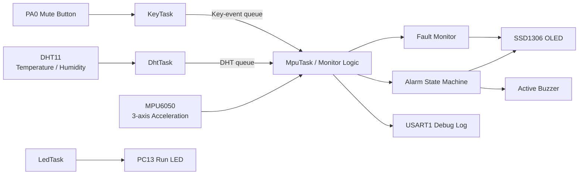

# STM32 FreeRTOS Device Condition Monitor — Portfolio Overview


A multi-sensor embedded monitoring system built on **STM32F103C8T6 + FreeRTOS** for vibration, temperature and humidity monitoring.

The project combines sensor acquisition, RTOS task scheduling, queue-based inter-task communication, fault diagnosis, hysteresis-based alarm logic, sensor recovery handling, OLED status display and buzzer control.

> 中文简介：该项目面向嵌入式设备状态监测场景，使用 MPU6050 采集三轴加速度、DHT11 采集温湿度、SSD1306 OLED 显示运行信息，并通过 FreeRTOS 多任务、队列、状态机、故障恢复和报警消音逻辑实现一个完整的小型监测系统。

---

## Why this project matters

This repository demonstrates more than basic sensor reading. It focuses on practical embedded-software concerns:

- multi-task scheduling with FreeRTOS;
- queue-based communication between tasks;
- sensor communication over I2C and a timing-sensitive single-wire interface;
- startup calibration of the MPU6050;
- invalid-data handling rather than silently reusing stale samples;
- consecutive-failure and consecutive-recovery confirmation;
- hysteresis to reduce alarm oscillation;
- alarm silencing without losing the underlying alarm state;
- automatic MPU recalibration after recovery;
- modular alarm and fault-monitor components;
- serial diagnostics for bring-up and troubleshooting.

---

## System Architecture



---

## RTOS Task Design

| Task | Main responsibility |
|---|---|
| `LedTask` | Run/status LED control |
| `DhtTask` | Periodically read DHT11 and publish the newest sample through a queue |
| `KeyTask` | Scan/debounce the mute button and publish key events |
| `MpuTask` | Read MPU6050, manage calibration/fault state, consume DHT/key messages, evaluate alarms, update OLED and buzzer |

The DHT queue has length 1 and uses overwrite semantics because the system cares about the **latest** environment sample rather than keeping a history buffer.

---

## Hardware Interfaces

| Function | STM32 pin/interface | Device |
|---|---|---|
| I2C1 SCL | PB6 | SSD1306 + MPU6050 |
| I2C1 SDA | PB7 | SSD1306 + MPU6050 |
| Single-wire data | PB11 | DHT11 |
| Buzzer output | PB12 | Active buzzer |
| Mute button | PA0 | Push button, active low |
| Run indicator | PC13 | On-board/status LED |
| Debug UART | PA9 / PA10 | USB-TTL serial adapter |
| SWD | PA13 / PA14 | ST-Link |

---

## Fault-Tolerant Monitoring Logic

### MPU6050 calibration

At startup, the firmware builds a static acceleration baseline from successful samples.

```text
Required valid samples : 50
Maximum attempts       : 100
Sampling interval      : 20 ms
```

Failed reads are excluded from the average. If calibration fails, the firmware does not use a zero baseline as though it were valid.

When an MPU fault is confirmed during operation:

```text
invalidate old baseline
→ clear derived vibration value
→ wait for sensor recovery
→ recalibrate automatically
→ resume monitoring
```

### Vibration metric

```text
S = |AX - base_ax|
  + |AY - base_ay|
  + |AZ - base_az|
```

This lightweight metric avoids floating-point processing and is suitable for a Cortex-M3 class MCU in a simple threshold-monitoring application.

### Hysteresis and consecutive confirmation

Typical vibration behavior:

```text
3 consecutive samples above alarm threshold
→ alarm

5 consecutive samples below recovery threshold
→ recover
```

Separate alarm and recovery thresholds reduce repeated toggling around a single boundary.

The same design principle is used for environmental alarms and communication fault/recovery confirmation.

---

## Alarm Behavior

A system alarm can be caused by:

- excessive vibration;
- high temperature;
- high humidity;
- confirmed DHT11 communication failure;
- confirmed MPU6050 communication/calibration failure.

Pressing the mute button disables the buzzer temporarily, but the internal alarm state and OLED indication remain active. Once all abnormal conditions recover, mute state is automatically cleared for the next event.

---

## Software Modules

```text
Core/
├── Inc/
│   ├── alarm.h
│   ├── dht11.h
│   ├── fault_monitor.h
│   ├── mpu6050.h
│   └── oled.h
└── Src/
    ├── alarm.c
    ├── dht11.c
    ├── fault_monitor.c
    ├── main.c
    ├── mpu6050.c
    └── oled.c
```

- `alarm.*` — vibration, environment and overall-alarm state logic.
- `fault_monitor.*` — reusable consecutive-failure / consecutive-recovery monitor.
- `mpu6050.*` — sensor initialization, ID check and acceleration reading.
- `dht11.*` — start sequence, timing-sensitive bit reception and validation.
- `oled.*` — SSD1306 display driver and UI output.
- `main.c` — queue creation, task creation, calibration and system integration.

---

## Skills demonstrated

This project can be used as a portfolio example for work involving:

- STM32 HAL development
- FreeRTOS tasks and queues
- I2C sensor integration
- timing-sensitive GPIO communication
- sensor calibration
- embedded state machines
- fault detection and recovery
- alarm and HMI logic
- UART diagnostics
- modular C firmware design

---

## Suggested demo evidence to add

For stronger job/freelance presentation, the next useful additions are:

- hardware photo showing STM32 + MPU6050 + DHT11 + OLED;
- OLED normal-state photo;
- OLED alarm-state photo;
- serial-log screenshot showing sensor fault and recovery;
- short GIF/video showing vibration alarm and mute-button behavior;
- simple wiring diagram exported as PNG/SVG.

These visual artifacts will make the repository much easier for a recruiter or client to evaluate in under one minute.
