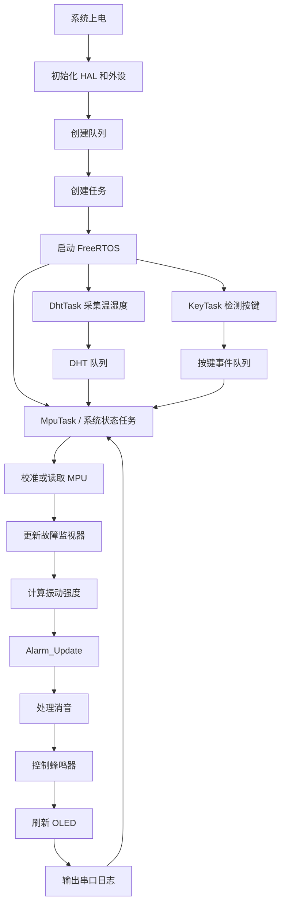

# 基于 STM32F103 与 FreeRTOS 的设备状态异常监测系统

## 1. 项目简介

本项目基于 **STM32F103C8T6 + FreeRTOS**，实现设备振动、环境温度和湿度的实时监测。系统通过 MPU6050 采集三轴加速度，通过 DHT11 采集温湿度，并使用 SSD1306 OLED 显示数据。

当出现振动异常、温度过高、湿度过高、DHT11 通信故障、MPU6050 通信故障或 MPU 校准失败时，系统进入报警状态，通过 OLED 和有源蜂鸣器提示。用户可以通过按键暂时关闭蜂鸣器，但真实报警状态仍然保留。

当前版本采用 **阈值、状态机、连续计数和故障诊断**完成异常检测，不包含神经网络或 TinyML 推理。

---

## 2. 已实现功能

- FreeRTOS 多任务调度；
- MPU6050 三轴加速度采集；
- DHT11 温湿度采集；
- SSD1306 OLED 实时显示；
- 有源蜂鸣器报警；
- PA0 按键消音；
- USART1 串口日志输出；
- FreeRTOS 队列传递 DHT 数据和按键事件；
- MPU6050 静态基准校准；
- 仅使用读取成功的样本计算基准；
- 校准最大尝试次数保护；
- 振动连续超限确认；
- 振动连续恢复确认；
- 温度、湿度和振动双阈值滞回；
- DHT11 连续失败故障检测；
- MPU6050 连续失败故障检测；
- 故障后连续成功恢复确认；
- MPU 本轮读取失败时不继续使用旧振动值判断；
- MPU 确认故障后废弃旧基准；
- MPU 恢复后自动重新校准；
- 报警逻辑模块化；
- 通用故障监视器模块化；
- 报警消音后仍保留 OLED 报警状态；
- 全部异常恢复后自动取消消音。

---

## 3. 硬件平台

| 硬件 | 作用 |
|---|---|
| STM32F103C8T6 最小系统板 | 主控制器 |
| MPU6050 或兼容模块 | 三轴加速度采集 |
| DHT11 | 温湿度采集 |
| SSD1306 OLED | 数据和状态显示 |
| 有源蜂鸣器 | 声音报警 |
| 独立按键 | 报警消音 |
| ST-Link | 下载与调试 |
| USB 转 TTL | 串口日志查看 |

---

## 4. 硬件连接

### 4.1 总体引脚表

| STM32 引脚 | 模式 | 外设或作用 |
|---|---|---|
| PB6 | I2C1_SCL，复用开漏 | OLED SCL、MPU6050 SCL |
| PB7 | I2C1_SDA，复用开漏 | OLED SDA、MPU6050 SDA |
| PB11 | 动态切换输入/开漏输出 | DHT11 DATA |
| PB12 | GPIO 推挽输出 | 有源蜂鸣器 |
| PA0 | GPIO 输入、内部上拉 | 消音按键 |
| PC13 | GPIO 输出 | 运行指示灯 |
| PA9 | USART1_TX | USB 转串口 RX |
| PA10 | USART1_RX | USB 转串口 TX |
| PA13 | SWDIO | ST-Link SWDIO |
| PA14 | SWCLK | ST-Link SWCLK |
| NRST | 复位 | ST-Link NRST，可选但推荐 |

所有模块必须共地。

### 4.2 OLED 与 MPU6050

OLED 和 MPU6050 共用 I2C1：

| STM32 | OLED | MPU6050 |
|---|---|---|
| PB6 | SCL | SCL |
| PB7 | SDA | SDA |
| 3.3V | VCC | VCC |
| GND | GND | GND |

I2C 地址：

| 设备 | 7 位地址 | HAL 地址 |
|---|---:|---:|
| SSD1306 OLED | `0x3C` | `0x78` |
| MPU6050 | `0x68` | `0xD0` |

部分兼容 MPU 模块的 `WHO_AM_I` 可能读取为 `0x70`，驱动中可同时接受 `0x68` 和 `0x70`。

### 4.3 DHT11

| STM32 | DHT11 |
|---|---|
| PB11 | DATA |
| 3.3V | VCC |
| GND | GND |

DHT11 DATA 为单总线。STM32 先将 PB11 配置为输出发送启动信号，再切换为输入读取 40 位数据。

### 4.4 按键

```text
PA0 ───── 按键 ───── GND
```

PA0 使用内部上拉：

- 松开：高电平；
- 按下：低电平；
- 低电平有效。

### 4.5 串口

| STM32 | USB 转 TTL |
|---|---|
| PA9 / TX | RX |
| PA10 / RX | TX |
| GND | GND |

TX、RX 交叉连接。

---

## 5. GPIO 模式选择原则

```text
外部设备向 STM32 提供状态：输入
STM32 主动控制外部设备：输出
UART、I2C、SPI、PWM：复用功能
ADC 采集模拟电压：模拟模式
一根线双方轮流控制：动态切换输入/输出或使用开漏
```

本项目中：

- PA0 是输入，因为 STM32 需要读取按键；
- PC13、PB12 是输出，因为 STM32 需要控制 LED 和蜂鸣器；
- PB11 在输入与输出之间切换，因为 DHT11 是单线双向通信；
- PB6、PB7 是 I2C 复用开漏，因为 OLED 和 MPU6050 共享总线。

---

## 6. 软件环境

- STM32CubeMX 或 STM32CubeIDE；
- STM32 HAL 库；
- FreeRTOS；
- Keil MDK-ARM；
- ST-Link；
- STM32CubeProgrammer；
- 串口助手。

CubeMX 中应保留：

```text
System Core → SYS → Debug：Serial Wire
```

不要将 PA13、PA14 改为普通 GPIO。

---

## 7. 工程目录

```text
Core
├── Inc
│   ├── alarm.h
│   ├── dht11.h
│   ├── fault_monitor.h
│   ├── mpu6050.h
│   └── oled.h
└── Src
    ├── alarm.c
    ├── dht11.c
    ├── fault_monitor.c
    ├── main.c
    ├── mpu6050.c
    └── oled.c
```

| 文件 | 作用 |
|---|---|
| `main.c` | 外设初始化、队列创建、任务创建、系统状态处理 |
| `oled.c/.h` | OLED 初始化和显示 |
| `mpu6050.c/.h` | MPU 初始化、ID 和三轴数据读取 |
| `dht11.c/.h` | DHT11 时序、读取和校验 |
| `alarm.c/.h` | 振动、温湿度和系统总报警状态机 |
| `fault_monitor.c/.h` | 通用故障与恢复监视器 |

---

## 8. FreeRTOS 任务设计

| 任务 | 主要职责 |
|---|---|
| `LedTask` | 控制运行指示灯 |
| `DhtTask` | 周期读取 DHT11 并通过队列发送数据 |
| `KeyTask` | 按键扫描、消抖、等待释放、发送按键事件 |
| `MpuTask` | 接收数据、读取 MPU、故障判断、报警决策、显示与输出 |

`MpuTask` 实际已经承担系统状态管理任务，也可以在后续版本中重命名为 `MonitorTask` 或 `SystemTask`。

资源创建顺序：

```text
创建 DHT 队列
→ 创建按键队列
→ 创建任务
→ 启动调度器
```

---

## 9. FreeRTOS 队列通信

### 9.1 DHT 消息结构

```c
typedef struct
{
    uint8_t temperature;
    uint8_t humidity;
    uint8_t valid;
} DHT_Message_t;
```

队列长度为 1：

```c
g_dht_queue = xQueueCreate(1, sizeof(DHT_Message_t));
```

发送最新值：

```c
xQueueOverwrite(g_dht_queue, &message);
```

非阻塞接收：

```c
if (xQueueReceive(g_dht_queue, &new_message, 0) == pdPASS)
{
    dht_message = new_message;
}
```

使用长度为 1 的覆盖式队列，是因为系统只关心最新温湿度，不保存历史数据。

### 9.2 按键事件队列

```c
g_key_queue = xQueueCreate(1, sizeof(uint8_t));
```

`KeyTask` 检测到有效按键后发送事件，系统状态任务接收后设置消音标志。

---

## 10. MPU6050 校准

### 10.1 校准原因

设备静止时三轴值不一定为零，原因包括：

- 重力分量；
- 安装方向；
- 传感器零偏；
- 模块个体差异。

系统启动时计算静态基准：

```text
base_ax
base_ay
base_az
```

### 10.2 校准参数

```c
#define MPU_CALIBRATION_SAMPLE_COUNT   50
#define MPU_CALIBRATION_MAX_ATTEMPTS   100
#define MPU_CALIBRATION_INTERVAL_MS    20
```

规则：

- 必须收集 50 个读取成功的样本；
- 总尝试次数最多 100 次；
- 失败样本不参与累加；
- 使用真实成功样本数计算平均值；
- 成功样本不足则校准失败；
- 校准失败时不使用零基准计算振动。

### 10.3 自动重新校准

运行中 MPU 确认故障后：

```text
calibration_ok = 0
vibration = 0
```

原基准作废。重新接好并保持静止后，系统重新收集有效样本、建立基准、重置 MPU 故障监视器并恢复监测。

---

## 11. 振动强度计算

```text
S = |AX - base_ax|
  + |AY - base_ay|
  + |AZ - base_az|
```

优点：

- 计算量小；
- 不需要浮点运算；
- 适合 Cortex-M3；
- 减少固定重力分量和安装方向的影响；
- 便于实时阈值判断。

该算法适合基础设备状态监测，不等同于频谱分析或机器学习分类。

---

## 12. 报警状态机

### 12.1 默认阈值

```c
#define VIBRATION_ALARM_THRESHOLD       3000
#define VIBRATION_RECOVER_THRESHOLD     1800
#define VIBRATION_ALARM_COUNT_LIMIT     3
#define VIBRATION_RECOVER_COUNT_LIMIT   5

#define TEMP_HIGH_THRESHOLD             35
#define TEMP_RECOVER_THRESHOLD          33

#define HUM_HIGH_THRESHOLD              85
#define HUM_RECOVER_THRESHOLD           80
```

### 12.2 振动报警

正常状态：

```text
连续 3 次 S > 3000 → 进入报警
```

报警状态：

```text
连续 5 次 S < 1800 → 解除报警
```

`1800～3000` 为滞回区间，保持原状态。

### 12.3 温度报警

```text
温度 ≥ 35℃：报警
温度 ≤ 33℃：恢复
33℃～35℃：保持原状态
```

### 12.4 湿度报警

```text
湿度 ≥ 85%：报警
湿度 ≤ 80%：恢复
80%～85%：保持原状态
```

### 12.5 系统总报警

任意条件成立即报警：

```text
振动异常
或 温度异常
或 湿度异常
或 DHT11 故障
或 MPU6050 综合故障
```

---

## 13. 数据有效性管理

### DHT11

`valid=1` 表示本次数据有效，`valid=0` 表示读取失败。

只有收到新的 DHT 队列消息时才更新故障计数，避免同一次失败被 `MpuTask` 每 300 ms 重复统计。

DHT11 确认故障后：

- 不继续使用旧温湿度判断异常；
- 温湿度报警状态清除；
- 系统由 DHT 故障标志报警；
- OLED 温湿度显示 `--`。

### MPU6050

系统区分：

| 变量 | 含义 |
|---|---|
| `mpu_read_ok` | 本轮读取是否成功 |
| `fault_flag` | 是否经过连续失败确认故障 |
| `calibration_ok` | 是否有可靠静态基准 |
| `mpu_effective_fault` | 校准失败或通信故障 |

若本轮 MPU 读取失败但还没确认故障：

- 不使用旧振动值产生新的报警判断；
- 保留原振动报警状态；
- 清零连续报警和连续恢复计数。

---

## 14. 通用故障监视器

```c
typedef struct
{
    uint8_t fault_count;
    uint8_t recover_count;
    uint8_t fault_flag;
} FaultMonitor_t;
```

默认参数：

```c
#define DHT_FAULT_COUNT_LIMIT       3
#define DHT_RECOVER_COUNT_LIMIT     2
#define MPU_FAULT_COUNT_LIMIT       3
#define MPU_RECOVER_COUNT_LIMIT     2
```

状态转换：

```text
正常
  │ 连续失败 3 次
  ▼
故障
  │ 连续成功 2 次
  ▼
正常
```

DHT11 和 MPU6050 使用独立实例，计数互不影响。

接口：

```c
FaultMonitor_Init(&monitor);

FaultMonitor_Update(&monitor,
                    read_ok,
                    fault_limit,
                    recover_limit);
```

---

## 15. 报警模块

```c
typedef struct
{
    uint8_t vibration_alarm;
    uint8_t temperature_alarm;
    uint8_t humidity_alarm;
    uint8_t system_alarm;
} AlarmState_t;

typedef struct
{
    uint8_t vibration_alarm_count;
    uint8_t vibration_recover_count;
    AlarmState_t state;
} AlarmManager_t;
```

初始化：

```c
Alarm_Init(&alarm_manager);
```

更新：

```c
Alarm_Update(&alarm_manager,
             vibration,
             temperature,
             humidity,
             dht_valid,
             mpu_read_ok,
             dht_fault_monitor.fault_flag,
             mpu_effective_fault);
```

统一报警状态来源：

```c
alarm_manager.state.vibration_alarm
alarm_manager.state.temperature_alarm
alarm_manager.state.humidity_alarm
alarm_manager.state.system_alarm
```

---

## 16. 按键消音

按键流程：

```text
第一次检测到低电平
→ 延时 20 ms
→ 再次检测
→ 发送按键事件
→ 等待按键释放
```

状态含义：

```text
SYS=1，MUTE=0：报警，蜂鸣器响
SYS=1，MUTE=1：报警仍存在，蜂鸣器关闭
SYS=0，MUTE=0：系统正常
```

消音只关闭声音，不清除 OLED 报警和真实故障。全部异常恢复后自动清除 `MUTE`，保证下一次报警重新发声。

---

## 17. OLED 显示

正常：

```text
T: 温度
H: 湿度
S: 振动强度
OK
```

异常或数据无效：

- DHT 数据无效或故障：温湿度显示 `--`；
- MPU 未校准、本轮读取失败或故障：振动显示 `--`；
- 任意报警：显示 `ALARM`；
- 按键消音后仍显示 `ALARM`。

---

## 18. 串口日志

示例：

```text
T=24 C, H=75 %, DHT_V=1,
AX=-120, AY=80, AZ=16320, S=650,
CAL=1, MPU_OK=1,
V_ALM=0, T_ALM=0, H_ALM=0,
DHT_F=0, MPU_F=0, SYS=0, MUTE=0
```

| 字段 | 含义 |
|---|---|
| `T` | 温度 |
| `H` | 湿度 |
| `DHT_V` | DHT 本次数据有效状态 |
| `AX/AY/AZ` | 三轴原始值 |
| `S` | 振动强度 |
| `CAL` | MPU 校准状态 |
| `MPU_OK` | 本轮 MPU 读取状态 |
| `V_ALM` | 振动报警 |
| `T_ALM` | 温度报警 |
| `H_ALM` | 湿度报警 |
| `DHT_F` | DHT 故障 |
| `MPU_F` | MPU 综合故障 |
| `SYS` | 系统总报警 |
| `MUTE` | 消音状态 |

---

## 19. 系统流程



---

## 20. 编译与运行

1. CubeMX 配置 GPIO、I2C1、USART1 和 FreeRTOS；
2. 保留 SYS Debug 为 `Serial Wire`；
3. 将自定义 `.c` 文件加入 Keil 工程；
4. 确认 `Core/Inc` 在头文件搜索路径；
5. 创建队列后再创建任务；
6. 检查任务创建返回值；
7. 启动校准时保持 MPU 静止；
8. BOOT0 正常运行时保持为 0。

项目曾因 FreeRTOS heap 不足导致任务创建失败，最终将 `configTOTAL_HEAP_SIZE` 调整到约 8192 字节后正常运行。实际值应结合任务栈和队列重新评估。

---

## 21. 测试项目

### 正常启动

预期：

```text
CAL=1
MPU_OK=1
DHT_F=0
MPU_F=0
V_ALM=0
T_ALM=0
H_ALM=0
SYS=0
MUTE=0
```

### 振动报警与恢复

- 连续晃动后 `V_ALM=1`、`SYS=1`；
- 停止振动并连续低于恢复阈值后解除。

### 按键消音

- 报警时按下 PA0；
- `SYS=1`、`MUTE=1`；
- OLED 仍显示 `ALARM`；
- 蜂鸣器停止；
- 全部恢复后 `MUTE=0`。

### DHT11 故障与恢复

- 断开 DATA；
- 连续失败后 `DHT_F=1`；
- 温湿度显示 `--`；
- 重新连接并连续成功后恢复。

### MPU6050 故障与恢复

- 断开 SDA 或 SCL；
- 连续失败后 `MPU_F=1`、`CAL=0`；
- 振动显示 `--`；
- 重新连接并保持静止；
- 自动重新校准；
- `CAL=1`、`MPU_F=0`。

带电断开 SCL 可能使 I2C 停在未完成帧。测试时优先断开 MPU 的 SDA，或断电后调整接线。

### 多异常并发

只要任意异常仍存在，`SYS` 必须保持 1；只有全部恢复后才回到 0。

### 长时间运行

建议连续运行至少 30 分钟，观察 OLED、串口、按键、传感器更新和任务是否稳定。

---

## 22. 常见问题

### 22.1 任务创建失败

现象：`xTaskCreate()` 返回失败。

处理：

- 增大 FreeRTOS heap；
- 检查任务栈大小；
- 检查队列是否重复创建；
- 打印每个创建函数的返回值。

### 22.2 OLED 或 MPU 无响应

检查：

- PB6、PB7 接线；
- 设备地址；
- 供电和共地；
- I2C 上拉；
- I2C 扫描是否找到 `0x3C` 和 `0x68`。

### 22.3 DHT11 超时

检查：

- PB11 接线；
- DATA 上拉；
- 微秒延时；
- 系统时钟；
- 读取间隔；
- 供电稳定性。

### 22.4 校准失败

可能原因：

- MPU 未连接；
- I2C 通信异常；
- 有效样本不足；
- 校准期间持续移动；
- 接线接触不良。

### 22.5 重新接线后仍不能校准

可能是 I2C 在断线时停在未完成通信状态。优先：

1. 接好 SDA/SCL；
2. 完整断电再上电；
3. 保持 MPU 静止；
4. 必要时重新初始化 I2C 和 MPU；
5. 后续可扩展 9 个 SCL 时钟和 STOP 的 I2C 总线恢复。

当前工程实测重新接线后可以自动重新校准，因此未强制加入手动总线恢复代码。

### 22.6 `Flash Download failed - Target DLL has been cancelled`

处理顺序：

1. 关闭可能占用 ST-Link 的软件；
2. 重插 ST-Link 和开发板；
3. 检查 SWDIO、SWCLK、GND 和供电；
4. 将 SWD 频率降低到 100 kHz；
5. 检查 Keil Flash Algorithm；
6. 使用 STM32CubeProgrammer 执行 Full Chip Erase；
7. 必要时 BOOT0 置 1 后擦除；
8. 擦除完成后 BOOT0 恢复为 0；
9. 重新下载程序。

复位只会重新运行原程序，不能替代全片擦除。

---

## 23. 当前项目边界

当前核心版本不继续增加：

- Wi-Fi 云端上报；
- SPI Flash 日志；
- SD 卡；
- TinyML；
- 手机 App；
- Web 平台；
- 动态串口阈值配置。

这些可作为后续扩展，但不属于当前项目收尾范围。

---

## 24. 可扩展方向

1. W25Q64 SPI Flash 保存报警日志；
2. RS485 / Modbus RTU 工业监测节点；
3. 串口动态修改阈值；
4. 看门狗和任务运行监控；
5. 参数掉电保存；
6. TinyML 振动模式分类；
7. Wi-Fi 或以太网上报。

---

## 25. 项目亮点

- FreeRTOS 多任务架构；
- 覆盖式队列传递最新状态；
- 数据采集、故障判断、报警决策和输出控制分层；
- 连续超限、连续恢复和双阈值滞回；
- 通用故障监视器复用多个传感器；
- 区分单次读取失败、确认故障和校准失效；
- 有效样本校准和最大尝试次数保护；
- MPU 故障恢复后自动废弃旧基准并重新校准；
- 按键消音不掩盖真实报警；
- OLED、蜂鸣器和串口使用统一状态来源；
- 报警模块和故障模块独立，便于维护。

---

## 26. 简历描述参考

### 项目名称

**基于 STM32F103 与 FreeRTOS 的设备状态异常监测系统**

### 项目描述

基于 STM32F103C8T6 和 FreeRTOS 开发设备状态监测系统，使用 MPU6050 采集三轴加速度、DHT11 采集温湿度，通过 OLED 实时显示监测数据，并使用蜂鸣器和按键实现报警与消音。

### 技术要点

- 使用 FreeRTOS 划分传感器采集、按键检测、状态管理和指示灯任务；
- 使用 FreeRTOS 队列传递 DHT11 数据和按键事件；
- 基于三轴静态基准计算振动强度；
- 采用连续超限确认、双阈值滞回和连续恢复策略降低误报警；
- 设计通用故障监视器，实现 DHT11 和 MPU6050 连续失败确认与恢复；
- 使用有效样本计数和超时保护完成 MPU6050 启动校准；
- MPU 故障恢复后自动重新校准，避免继续使用失效基准；
- 将报警状态机和故障检测封装为独立模块。

---

## 27. 面试讲解顺序

1. 项目解决的问题；
2. 为什么使用 FreeRTOS；
3. 任务如何划分；
4. 队列如何传递数据；
5. 振动强度如何计算；
6. 如何避免误报警；
7. 如何检测传感器掉线；
8. 为什么故障恢复后要重新校准；
9. 为什么消音不清除报警；
10. 项目遇到的主要问题和解决过程；
11. 如何通过模块化提高可维护性。

---

## 28. 最终验收清单

- [x] FreeRTOS 多任务运行；
- [x] DHT11 温湿度读取；
- [x] MPU6050 三轴读取；
- [x] OLED 实时显示；
- [x] USART1 日志；
- [x] DHT 队列；
- [x] 按键事件队列；
- [x] 振动、温度、湿度报警；
- [x] 双阈值滞回；
- [x] 连续报警和连续恢复；
- [x] DHT 故障检测与恢复；
- [x] MPU 故障检测与恢复；
- [x] 旧数据有效性管理；
- [x] MPU 有效样本校准；
- [x] 校准超时保护；
- [x] 故障后旧基准失效；
- [x] 自动重新校准；
- [x] 蜂鸣器报警；
- [x] 按键消音；
- [x] 消音后保留报警；
- [x] 报警恢复后自动取消消音；
- [x] 报警模块化；
- [x] 故障监视器模块化；
- [x] 正常、异常、故障和恢复测试。

---

## 29. 说明

本项目适用于嵌入式学习、课程实践、个人作品集和实习展示。

进入实际工业应用前，还需要增加：

- 看门狗；
- 任务运行监控；
- 参数掉电保存；
- 长时间老化测试；
- EMC 和电源稳定性测试；
- 真实设备阈值标定；
- 更可靠的连接器与 PCB；
- 报警等级和安全策略设计。
